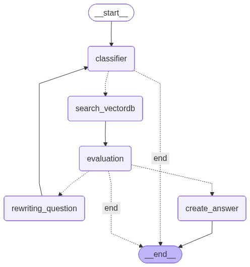
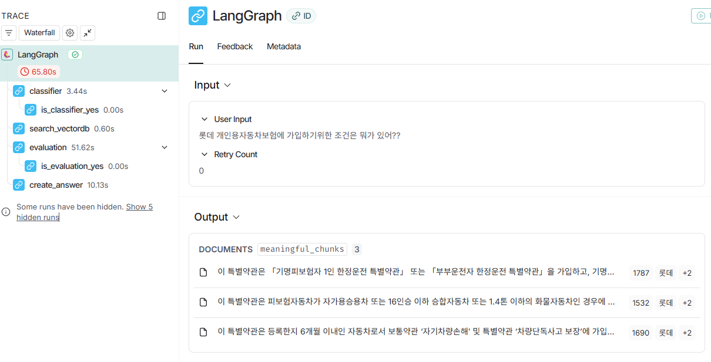
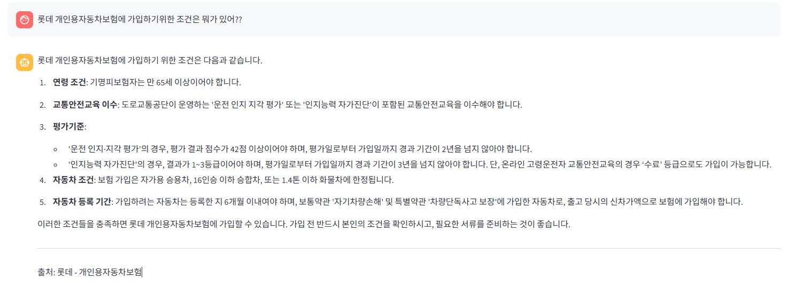

# 🚗 운전자 보험 약관 RAG 챗봇 (SKN18-3rd-1Team)

> "데이터로 약관을 읽다 — AI가 보험의 언어를 소비자 언어로 번역합니다."

**프로젝트 기간:** 2025.10.24. – 2025.10.27.  
**핵심 기술:** LangGraph · PGVector · PyMuPDF4LLM · PyMuPDF  
---

---
 ## 팀 구성 및 역할

<style scoped>
table {
  font-size: 0.75em;
}
img {
  width: 80px;
  height: 96px;
}
</style>

<table width="100%">
  <tr>
    <td align="center">팀원</td>
    <td width="20%" align="center">
      <br/>
      <b>안시현</b>
    </td>
    <td width="20%" align="center">
      <br/>
      <b>정동석</b>
    </td>
    <td width="20%" align="center">
      <br/>
      <b>최은정</b>
    </td>
    <td width="20%" align="center">
      <br/>
      <b>김수미</b>
    </td>
  </tr>
  <tr>
    <td align="center">역할</td>
    <td align="center">데이터 수집·전처리</td>
    <td align="center">평가 및 루프 튜닝</td>
    <td align="center">LangGraph 워크플로우 설계</td>
    <td align="center">노드 설계·임베딩</td>
  </tr>
  <tr>
    <td align="center">주요 담당 모듈</td>
    <td align="center">`preprocess_v2.py`
    `parsers 파일들`</td>
    <td align="center">`evaluation_node.py`, `rewrite_node.py`</td>
    <td align="center">`build_graph.py`, `create_node.py`</td>
    <td align="center">`embedding_models.py`, `search_vectordb_node.py`</td>
  </tr>
<tr>
    <td align="center">세부 기여</td>
    <td align="center">약관 PDF → Markdown 파이프라인 구축/ 데이터 전처리</td>
    <td align="center">Faithfulness·Relevancy 기반 평가, 질문 재작성 로직 구현</td>
    <td align="center">노드 간 데이터 흐름 제어, 루프 조건 설계</td>
    <td align="center">임베딩 모델 및 PGVector 저장 구조 구현</td>
</tr>
  <td align="center">GitHub</td>
  <td align="center"><a href="https://github.com/ansi212972-only"></a><br/></td>
  <td align="center"><a href="https://github.com/dsj-1004"></a><br/></td>
  <td align="center"><a href="https://github.com/eunjeong0911"></a><br/></td>
  <td align="center"><a href="https://github.com/ghyeju0904"></a><br/></td>
  </tr>
</table>


## 🧭 프로젝트 개요

운전자보험 약관은 일반 소비자가 이해하기 어려운 복잡한 문서입니다.  
수백 페이지의 텍스트 속에서 사용자가 원하는 조항을 직접 찾는 것은 현실적으로 불가능합니다.  

우리 팀의 챗봇은 **LangGraph 기반 RAG(ReAct-Augmented Generation) 구조**로,  
자연어 질문에 대해 **정확한 약관 조항 근거와 출처를 함께 제시**합니다.

---

## ⚙️ 약관의 문제점

| 문제 영역 | 구체적 내용 |
|------------|-------------|
| **방대한 분량** | 각 보험사마다 평균 100~200페이지 분량 |
| **전문 용어 난무** | 법률/계약 용어가 반복되어 일반 소비자 이해 어려움 |
| **잦은 개정** | 개정 주기가 짧아 최신 약관 확인이 어려움 |
| **정보 비대칭성** | 보험사는 모든 정보를 갖지만 가입자는 제한된 정보만 접근 가능 |
| **불신 유발 구조** | “약관에 다 명시되어 있습니다”라는 문구가 소비자 불신 초래 |

---

## 💡 프로젝트 배경 및 목적

### 1️⃣ 배경
보험 약관은 소비자 권리 사각지대의 원인입니다.  
우리 팀은 AI를 통해 약관의 **구조적 이해와 정보 접근의 평등성**을 구현하고자 했습니다.

### 2️⃣ 목적
- **자연어 질의 기반 약관 탐색**: 사용자가 일상 언어로 질문해도 조항 근거 자동 반환  
- **출처 신뢰 확보**: 답변마다 보험사명, 조항번호 근거 표시  

---

## 🎯 타겟 사용자

### 1. 신규 보험 가입 검토자

> **"어떤 보험이 나에게 맞을까?"**

- **보험 초보자**: 운전자보험이 처음이라 어떤 보장이 필요한지 모르는 사용자
- **비교 검토자**: 여러 보험사 상품을 비교하며 보장 내용을 꼼꼼히 확인하고 싶은 사용자
- **설계사 상담 전 준비자**: 보험사 방문 전 미리 약관을 이해하고 질문을 준비하려는 사용자

### 2. 기존 가입자 (약관 확인)

> **"내 보험에 이런 보장이 있었나?"**

- **사고 발생 시**: 실제 사고가 났을 때 본인의 보험 보장 범위를 급히 확인해야 하는 사용자
- **보험금 청구 전**: 청구 가능한 항목과 필요 서류를 미리 파악하고 싶은 사용자
- **갱신 검토자**: 기존 약관과 신규 약관의 차이점을 비교하며 갱신을 고민하는 사용자

---

### 🧠 기술 스택

| 분야 | 기술 | 역할 |
|------|------|------|
| **AI 모델** | GPT-4o-mini, GPT-5-nano | 답변 생성 / 질의 분류 / 평가 |
| **임베딩** | OpenAI `text-embedding-3-large` | 문서 벡터화 및 유사도 검색 |
| **워크플로우** | LangGraph | RAG 파이프라인 제어 (노드 기반) |
| **벡터 DB** | PostgreSQL + PGVector | 고성능 유사도 검색 및 메타데이터 관리 |
| **문서 처리** | PyMuPDF4LLM · PyMuPDF | 보험사별 PDF 구조에 따라 변환/파싱 선택 적용 |
| **환경 구성** | Python 3.13+, dotenv | 키 관리 및 실행 환경 설정 |
| **웹 UI** | streamlit | 화면 구현 |

---

## 📚 데이터 구성

### 활용 문서

KB, 롯데, 삼성화재, 하나, 현대 운전자보험 약관 (직접 수집 및 전처리)

### 전처리 파이프라인
1. **회사별 전용 파서 실행** — PDF 구조에 따라 `PyMuPDF4LLM` 또는 `PyMuPDF` 선택 적용  
2. **목차 및 쪽번호 제거**
3. **편·장·절·조 단위 구조 파싱**
4. **조항 단위 데이터 분할**
5. **CSV 저장 (`insurance_clauses_v2.csv`)**

> 🚀 `preprocess_v2.py`는 회사별 파서를 자동 선택하여,  
> 각 보험사의 문서 구조에 맞는 최적 전처리를 수행합니다.

---

### 데이터 특징

| 항목                | 설명                                          |
| ------------------- | --------------------------------------------- |
| **조 단위 분할**    | 각 조항을 개별 행으로 나누어 검색 정확도 강화 |
| **계층 정보 보존**  | 편 > 장 > 절 > 조 경로를 "조항" 컬럼에 기록   |
| **내용만 임베딩**   | "내용" 컬럼만 임베딩하여 유사도 계산 수행     |
| **메타데이터 활용** | 보험사, 상품명, 조항경로를 필터링에 사용      |

---

## 🧩 LangGraph 워크플로우

```
start → query_classifier → search_vectordb → evaluation
├─ pass → create_answer → end
└─ fail → rewrite_question → classifier → search_vectordb
```
---


---
### 노드별 기능 요약

| 노드                 | 설명                                              |
| -------------------- | ------------------------------------------------- |
| **query_classifier** | 질문 유형 분류 및 비보험 관련 질문 필터링         |
| **search_vectordb**  | PGVector 기반 유사도 검색 및 상위 문맥 추출       |
| **evaluation**       | 질문-문서 관련성 점수 평가 (0~1 점수, 임계값 0.7) |
| **rewrite_question** | 점수 미달 시 질문 의미 재작성 및 재검색           |
| **create_answer**    | LLM이 최종 요약 및 출처 포함 답변 생성            |

---

#### LangSmith 모니터링
> LangSmith를 통해 각 노드의 실행 과정과 성능을 실시간으로 모니터링합니다.
> 


---
## 📁 프로젝트 구조

```
project_root/
├── .venv/                             # 가상환경 (Python 환경 격리)
│
├── data/                              # 보험 약관 원본 및 전처리 결과 CSV 저장 폴더
│
├── pgvector/
│   └── database/
│       ├── docker-compose.yml              # PostgreSQL + PGVector 컨테이너 설정
│       └── init.sql                        # 초기 스키마 및 vector 확장 설치 SQL
│
├── preprocessing/                          # 전처리 파이프라인
│   ├── preprocess_v2.py                    # 메인 전처리 스크립트 (회사별 파서 자동 선택)
│   └── parsers/                            # 보험사별 전용 파서
│       ├── base_parser.py                  # 공통 파서 베이스 클래스
│       ├── hana_parser.py                  
│       ├── hyundai_parser.py               
│       ├── hyundai_parser_fixed.py         
│       ├── kb_parser.py                    
│       ├── kb_business_parser.py           
│       ├── lotte_parser.py                 
│       ├── lotte_business_parser.py   
│       ├── lotte_wheel_parser.py      
│       ├── samsung_personal_parser.py 
│       ├── samsung_business_parser.py 
│       ├── samsung_commercial_parser.py 
│       ├── samsung_oneday_parser.py   
│       ├── samsung_wheel_parser.py    
│       ├── table_cleaner.py           
│       └── __init__.py
│
├── rag_pipline/                       # LangGraph 기반 RAG 파이프라인
│   ├── build_graph.py                 # 그래프 전체 워크플로우 정의
│   │
│   ├── nodes/                         # LangGraph 노드 구성
│   │   ├── query_classifier_node.py   # 질의 유형 분류 (single/comparison/other)
│   │   ├── search_vectordb_node.py    # PGVector 기반 유사 문서 검색
│   │   ├── evaluation_node.py         # GPT-5-nano로 관련성 평가 (0~1 점수)
│   │   ├── rewrite_node.py            # 질문 재작성 (모호 질의 개선)
│   │   └── create_node.py             # GPT-4o-mini로 답변 생성 + 출처 표시
│   │
│   └── vectordb/                      # 벡터 임베딩 및 검색 관련 모듈
│       ├── custom_pgvector.py         # Singleton 기반 PGVector 검색 클래스
│       ├── vector_store.py            # CSV → 임베딩 생성 → DB 저장
│       └── __init__.py
│
├── scripts/                           # 그래프 실행 및 시각화 스크립트
│   ├── run_graph.py                   # CLI 기반 그래프 실행 진입점
│   ├── draw_graph.py                  # Mermaid 기반 LangGraph 구조 시각화
│   └── __init__.py
│
├── app.py                             # Streamlit 등 웹 인터페이스 실행 파일
├── graph_structure.png                # LangGraph 구조 다이어그램
├── langsmith_dashboard.png            # LangSmith 실행 추적 결과 캡처
├── requirements.txt                   # 의존성 패키지 목록
├── .env                               # 환경 변수 파일 (API Key, DB 연결정보)
├── .gitignore                         # Git 추적 제외 파일 목록
└── README.md                          # 프로젝트 설명 문서


```

---

## 🧪 평가 체계

> **평가 방식**  
>
> - **관련성 점수**: GPT-5-nano 모델로 문서-질문 매칭 (0~1 스코어)
> - **임계값 기반 필터링**: 0.7 이상 점수를 받은 문서만 답변 생성에 활용
> - **자동 재검색**: 유의미한 문서가 없을 경우 질문 재작성 후 재검색 (max = 1)
> - **결과 관리**: 평균 점수, 유의미 청크 수, 재작성 여부 기록
>
> `evaluation_node.py`의 점수 계산 로직에 따라 자동화

---

## 💻 사용자 인터페이스

> **Streamlit 기반 웹 애플리케이션**
>
> - **좌측 사이드바:** 보험사 필터, 검색 옵션 설정  
> - **메인 화면:**  
>     - 질문 입력창
>     - 답변 카드 (요약 + 출처 조항 표시)  
>     - 관련성 점수 시각화
---



*사용자 친화적인 Streamlit 웹 인터페이스*

---

## 🔍 시스템 모니터링

### LangSmith 추적 결과

실제 질의 처리 과정을 LangSmith로 추적한 결과입니다:


*질문 "교통사고 시 보상 범위는?"에 대한 전체 워크플로우 실행 추적*

---

## 🔮 향후 발전 방향

| 항목                | 설명                             |
| ----------------- | ------------------------------ |
| **1. 비교형 답변 고도화** | 여러 보험사 약관을 한 문장 내에서 자동 비교 요약   |
| **2. 음성 질의 지원**   | STT 기반 질의 입력 및 대화형 인터페이스 확장    |
| **3. 약관 도메인 확장**  | 운전자보험 → 화재/건강/여행보험 등 범위 확대     |
| **4. 평가 피드백 루프**  | LangSmith 기반 평가 자동화 및 개선 루프 적용 |

---

본 프로젝트는 **보험 약관 이해도 개선을 위한 연구 목적**이며,  

법률적 자문이나 계약 효력을 대체하지 않습니다.  

원문 약관 및 보험사 공식 자료를 항상 병행하여 확인하시기 바랍니다.

---

*Made with ❤️ by SKN18-3rd-1Team*